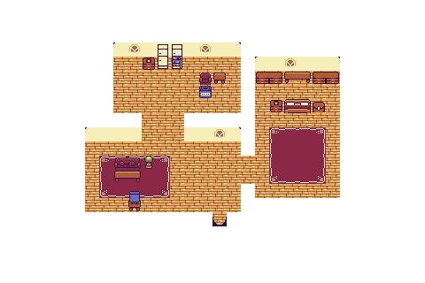
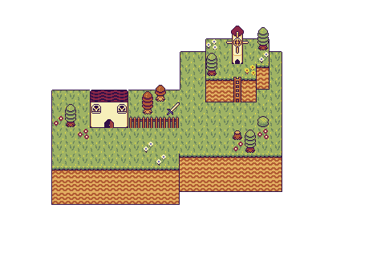
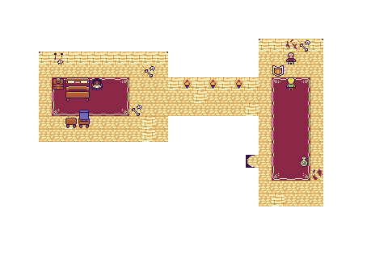

  
    <h1>Pixel Portfolio</h1>

This Pixel Portfolio is a repository for a highly interactive game developed using the `Kaboom JS Library` with `Terser Dependencies` and a `Vite Server`. The project leverages the `Tiled Software` to custom build maps, incorporating recursive calls to load maps efficiently.

## Features

- **Highly Interactive Gameplay**: Experience an engaging gameplay environment designed with the Kaboom JS Library.
  
- **Custom Maps**: Utilize custom-built maps created with Tiled Software, allowing for unique and immersive gaming experiences.

- **HD Sprites**: Employed a 16x16 Tileset created by [`Momen Games`](https://momen-games.itch.io/happy-la-v2-ts).

- **Efficient Map Loading**: Incorporate recursive calls to load maps efficiently, enhancing performance and user experience.

- **Responsive Design**: Enjoy seamless gameplay across different devices and screen sizes.

### `npm run dev`

Start dev server, aliases: `vite dev`, `vite serve`.\
Open [`http://127.0.0.1:5173/`](http://127.0.0.1:5173/) to view it in the browser.

## Maps

